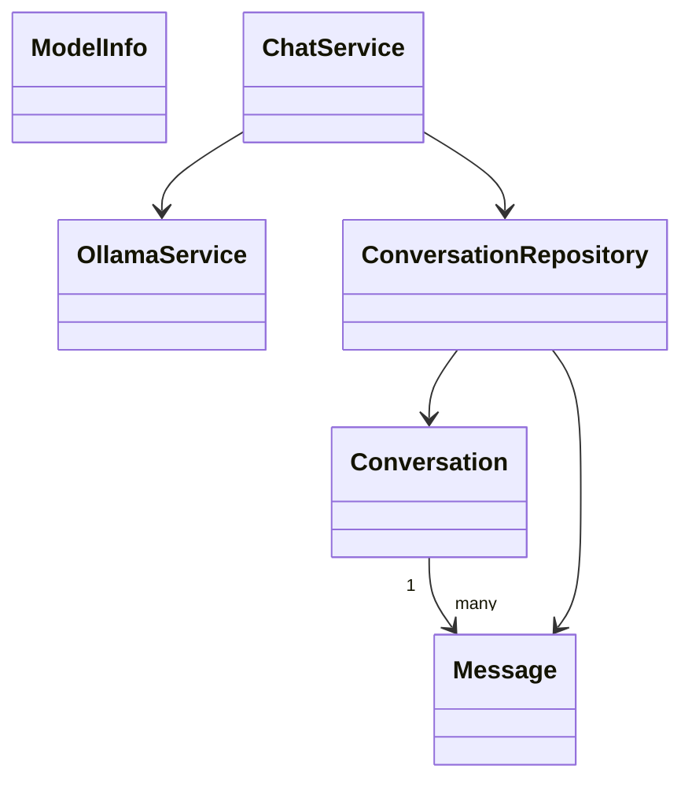

# Tutorial Early Bird 2: Local LLM Chat Client dengan TypeScript + Tauri

Dokumen ini memandu pembuatan aplikasi desktop chat untuk LLM lokal seperti Ollama. Aplikasi ini mirip ChatGPT sederhana, tetapi backend AI berjalan di komputer sendiri.

Tutorial ini menjelaskan struktur, arsitektur, alur streaming, penyimpanan conversation, dan bagian teknis penting. Kode yang diberikan hanya potongan kecil, bukan aplikasi lengkap.

---

## 1. Target Aplikasi

Aplikasi yang dibuat harus bisa:

- terhubung ke Ollama lokal
- menampilkan daftar model yang tersedia
- memilih model
- membuat conversation baru
- mengirim pesan user
- menampilkan jawaban assistant
- menampilkan response secara streaming
- menghentikan generation dengan tombol Stop
- menyimpan history chat
- mengatur system prompt
- render markdown dasar

MVP paling kecil: user bisa memilih model, mengirim satu pesan, dan melihat jawaban dari Ollama.

---

## 2. Domain Knowledge: Cara Kerja LLM Chat Lokal

Sebelum membuat aplikasi chat, mahasiswa perlu memahami perbedaan antara aplikasi chat biasa dan aplikasi chat berbasis LLM.

LLM atau Large Language Model adalah model AI yang menerima teks sebagai input dan menghasilkan teks sebagai output. Ollama adalah aplikasi yang menjalankan model tersebut di komputer lokal. Aplikasi yang dibuat mahasiswa bertindak sebagai frontend atau client untuk Ollama.

## 2.1 Model

Model adalah file AI yang dipakai untuk menghasilkan jawaban. Contoh model:

```text
llama3.2:1b
qwen2.5:0.5b
mistral
```

Semakin besar model, biasanya semakin bagus jawabannya, tetapi semakin berat dijalankan. Untuk laptop mahasiswa, model kecil lebih aman.

## 2.2 Message dan Role

Chat LLM biasanya disusun dari beberapa message. Setiap message punya role.

Role umum:

- `system`: instruksi umum untuk model
- `user`: pesan dari pengguna
- `assistant`: jawaban dari AI

Contoh:

```text
system: Jawab dalam Bahasa Indonesia.
user: Apa itu inheritance?
assistant: Inheritance adalah ...
```

LLM tidak benar-benar mengingat seperti manusia. Saat mengirim pesan baru, aplikasi biasanya mengirim ulang history percakapan agar model punya konteks.

## 2.3 System Prompt

System prompt adalah instruksi awal yang mengatur gaya jawaban model.

Contoh:

```text
Kamu adalah asisten dosen PBO. Jawab singkat, jelas, dan beri contoh TypeScript.
```

System prompt penting karena bisa mengubah gaya dan fokus jawaban.

## 2.4 Streaming

Streaming berarti jawaban muncul sedikit demi sedikit, bukan menunggu selesai seluruhnya.

Tanpa streaming:

```text
user menunggu -> jawaban lengkap muncul
```

Dengan streaming:

```text
kata pertama muncul -> kata berikutnya muncul -> sampai selesai
```

Streaming membuat aplikasi terasa lebih responsif, tetapi implementasinya sedikit lebih rumit karena aplikasi harus membaca potongan data.

## 2.5 Token

LLM tidak memproses teks persis per kata. Ia memproses token. Token bisa berupa kata, potongan kata, atau simbol.

Mahasiswa tidak perlu menghitung token secara detail untuk MVP, tetapi perlu tahu bahwa input terlalu panjang bisa membuat model lambat atau gagal.

## 2.6 Conversation History

Conversation history adalah daftar pesan dalam satu sesi chat. Jika history tidak disimpan, percakapan hilang saat aplikasi ditutup.

History juga penting untuk konteks. Misalnya user bertanya:

```text
Jelaskan lagi bagian nomor 2.
```

Model hanya bisa memahami maksudnya jika pesan sebelumnya ikut dikirim sebagai konteks.

---

## 3. Stack yang Digunakan

Rekomendasi stack:

- Tauri + Vite + TypeScript
- Frontend: React, Vue, Svelte, atau vanilla TypeScript
- `fetch` untuk memanggil API Ollama
- `marked` atau `markdown-it` untuk render markdown
- `dompurify` jika markdown renderer mengizinkan HTML
- `@tauri-apps/plugin-sql` untuk menyimpan conversation ke SQLite
- state management sederhana, misalnya `zustand` untuk React atau store bawaan framework

Ollama harus sudah berjalan di komputer mahasiswa.

Contoh setup manual:

```text
ollama pull llama3.2:1b
ollama serve
```

Biasanya Ollama tersedia di:

```text
http://localhost:11434
```

---

## 4. Struktur Folder yang Disarankan

```text
src/
  components/
    ChatBubble.tsx
    ChatInput.tsx
    ConversationSidebar.tsx
    ModelSelector.tsx
    SystemPromptEditor.tsx
  pages/
    ChatPage.tsx
  models/
    Conversation.ts
    Message.ts
    ModelInfo.ts
    GenerationState.ts
  services/
    OllamaService.ts
    ChatService.ts
    MarkdownService.ts
  repositories/
    ConversationRepository.ts
  utils/
    titleGenerator.ts
  errors/
    OllamaConnectionError.ts
    ModelNotFoundError.ts
```

Pembagian tanggung jawab:

- `OllamaService` khusus komunikasi ke Ollama
- `ChatService` mengatur alur conversation
- `ConversationRepository` menyimpan/membaca chat
- UI hanya menampilkan dan memanggil service

---

## 5. Model Utama

Model yang disarankan:

```ts
export type MessageRole = 'system' | 'user' | 'assistant'

export type Message = {
  id: string
  conversationId: string
  role: MessageRole
  content: string
  createdAt: string
  status?: 'sending' | 'streaming' | 'done' | 'failed'
}
```

```ts
export type Conversation = {
  id: string
  title: string
  systemPrompt: string
  model: string
  createdAt: string
  updatedAt: string
}
```

```ts
export type ModelInfo = {
  name: string
  size?: number
}
```

Jangan simpan semua chat dalam satu string besar. Pisahkan conversation dan message agar mudah ditampilkan, dihapus, dan disimpan.

---

## 6. Mengenal API Ollama

Endpoint penting:

```text
GET  /api/tags
POST /api/chat
POST /api/generate
```

Untuk aplikasi chat, gunakan:

```text
POST http://localhost:11434/api/chat
```

Contoh body request:

```ts
const payload = {
  model: 'llama3.2:1b',
  stream: true,
  messages: [
    { role: 'system', content: 'Jawab dalam Bahasa Indonesia.' },
    { role: 'user', content: 'Jelaskan konsep encapsulation.' },
  ],
}
```

Jika `stream: false`, Ollama mengembalikan jawaban setelah selesai semuanya.

Jika `stream: true`, Ollama mengembalikan banyak baris JSON. Setiap baris berisi potongan jawaban.

---

## 7. Arsitektur Sederhana

Alur kirim pesan:

```text
ChatPage
  -> ChatService.sendMessage()
    -> ConversationRepository.saveUserMessage()
    -> OllamaService.streamChat()
    -> ConversationRepository.updateAssistantMessage()
```

Penjelasan:

1. user mengetik pesan
2. UI memanggil `ChatService`
3. pesan user disimpan
4. aplikasi membuat message assistant kosong
5. `OllamaService` mengirim request ke Ollama
6. token jawaban diterima satu per satu
7. isi message assistant diperbarui
8. saat selesai, status message menjadi `done`

Dengan cara ini, jika streaming gagal, chat yang sudah masuk tidak hilang.

---

## 8. Implementasi Bertahap

## 8.1 Tahap 1 - Cek koneksi Ollama

Buat tombol atau proses awal untuk mengecek model.

Endpoint:

```text
GET http://localhost:11434/api/tags
```

Jika berhasil, tampilkan daftar model.

Jika gagal, tampilkan pesan:

```text
Ollama belum berjalan. Jalankan ollama serve terlebih dahulu.
```

## 8.2 Tahap 2 - Kirim pesan tanpa streaming

Untuk langkah awal, gunakan `stream: false` agar lebih mudah.

Alur:

1. user pilih model
2. user ketik pesan
3. app kirim ke `/api/chat`
4. app tampilkan jawaban

Setelah ini berhasil, baru lanjut streaming.

## 8.3 Tahap 3 - Tambahkan streaming

Streaming dari Ollama berupa JSON per baris.

Potongan parsing:

```ts
const reader = response.body?.getReader()
const decoder = new TextDecoder()
let buffer = ''

while (reader) {
  const { done, value } = await reader.read()
  if (done) break

  buffer += decoder.decode(value, { stream: true })
  const lines = buffer.split('\n')
  buffer = lines.pop() ?? ''

  for (const line of lines) {
    if (!line.trim()) continue
    const data = JSON.parse(line)
    const token = data.message?.content ?? ''
    // Tambahkan token ke bubble assistant.
  }
}
```

Jangan langsung membuat message baru setiap token. Token-token tersebut harus digabung ke message assistant yang sama.

## 8.4 Tahap 4 - Tambahkan tombol Stop

Gunakan `AbortController`.

Saat generation dimulai:

```ts
const controller = new AbortController()
```

Saat fetch:

```ts
fetch(url, { method: 'POST', body, signal: controller.signal })
```

Saat user menekan Stop:

```ts
controller.abort()
```

Setelah dibatalkan, tandai message assistant sebagai `failed` atau `cancelled`.

## 8.5 Tahap 5 - Simpan conversation

Gunakan SQLite.

Struktur tabel sederhana:

```text
conversations
  id
  title
  system_prompt
  model
  created_at
  updated_at

messages
  id
  conversation_id
  role
  content
  status
  created_at
```

Simpan pesan user sebelum request ke Ollama. Simpan/update pesan assistant selama streaming.

## 8.6 Tahap 6 - Tambahkan system prompt

System prompt adalah instruksi untuk model.

Contoh:

```text
Kamu adalah assistant yang menjawab singkat dalam Bahasa Indonesia.
```

Saat mengirim request, system prompt dimasukkan sebagai message pertama.

## 8.7 Tahap 7 - Render markdown

Jawaban LLM sering berisi markdown, misalnya list atau code block.

Gunakan `marked` atau `markdown-it`.

Perhatian: jika renderer mendukung HTML, bersihkan dengan `dompurify` agar tidak menampilkan HTML berbahaya.

---

## 9. Desain UI yang Disarankan

Layout sederhana:

```text
+----------------------+------------------------------+
| Conversation List    | Header: Model Selector       |
| New Chat             | Chat Messages                |
| System Prompt        |                              |
|                      | Input + Send + Stop          |
+----------------------+------------------------------+
```

Komponen penting:

- sidebar conversation
- dropdown model
- chat bubble user
- chat bubble assistant
- input area
- tombol send
- tombol stop
- indikator streaming

---

## 10. Error yang Harus Ditangani

Minimal tangani:

- Ollama belum berjalan
- model belum tersedia
- request timeout
- streaming terputus
- user mengirim pesan kosong
- user menekan send berkali-kali
- SQLite gagal menyimpan chat

Pesan error harus jelas. Contoh:

```text
Model belum tersedia. Jalankan: ollama pull llama3.2:1b
```

---

## 11. Checklist Manual Testing

Minimal uji:

- daftar model muncul
- pesan bisa dikirim
- response tampil
- streaming berjalan bertahap
- tombol Stop membatalkan generation
- conversation tersimpan setelah restart
- system prompt memengaruhi gaya jawaban
- markdown code block tampil rapi
- Ollama mati tidak membuat aplikasi crash
- model tidak tersedia menampilkan pesan error

---

## 12. Class Diagram Sederhana



---

## 13. Batasan MVP yang Wajar

MVP cukup mencakup:

- satu backend Ollama
- conversation history
- streaming response
- stop generation
- markdown dasar

Stretch goal:

- export chat ke Markdown
- prompt preset
- temperature setting
- regenerate response
- dukungan LM Studio atau OpenAI-compatible endpoint

Fokus utama proyek ini adalah chat berjalan stabil, streaming bisa dipahami, dan conversation tidak hilang setelah restart.
